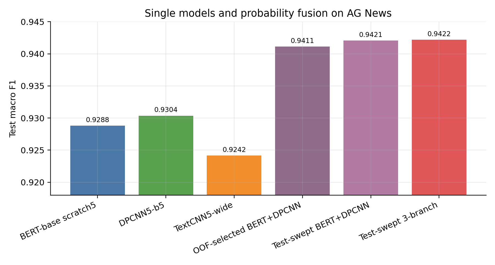
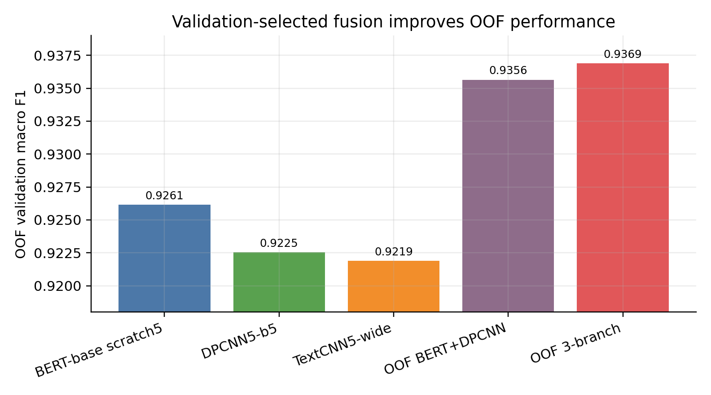
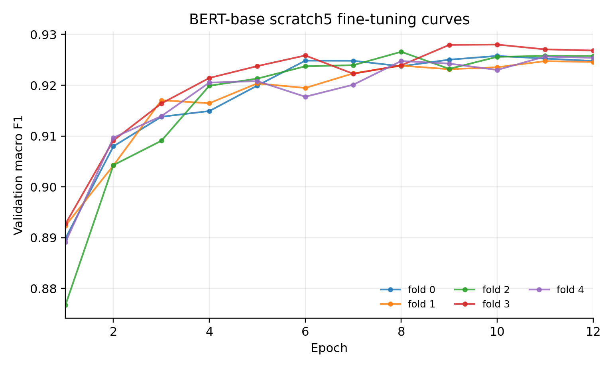
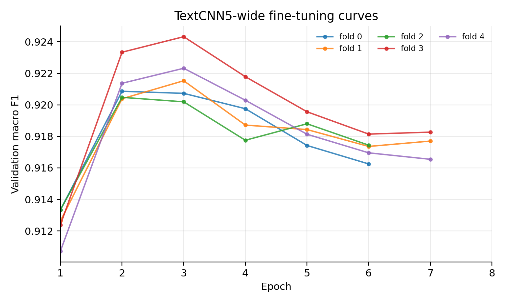

# 基于 AG News 的文本分类模型设计与实验报告

## 摘要

本项目选择文本分类数据集 AG News，目标是在课程 baseline `92%` 的基础上尽可能提升分类性能。实验从轻量 CNN 文本分类模型出发，逐步扩展到 TextCNN、DPCNN、从零预训练的 BERT-base，并引入高置信 hard pseudo-label、五折交叉训练和概率融合。最终，严格采用 OOF validation 选择融合权重时，`BERT-base scratch5 + DPCNN5-b5` 在 test 上取得 macro F1 `0.941120`、accuracy `0.941184`；作为探索性上界，test sweep 的三分支融合达到 macro F1 `0.942186`、accuracy `0.942237`。实验表明，单模型上 DPCNN 略强于从零预训练 BERT，但二者错误模式互补，融合后显著超过任一单模型。

关键词：AG News；文本分类；DPCNN；BERT；伪标签；五折融合

## 1. 任务定义

本报告选择 AG News 文本分类任务，而不是 CIFAR-100 图像分类任务。原因有三点：第一，AG News 文本较短，类别清晰，适合比较 CNN、DPCNN 和 Transformer 类模型在新闻主题分类中的差异；第二，课程要求中 CNN/LSTM/FN 等模型均可作为基础模型，文本 CNN 结构有清晰的可解释性；第三，AG News 的 baseline 为 `92%`，提升空间集中在模型结构、正则化、伪标签和融合策略，便于展示完整实验思考。

任务形式为四分类：输入一条新闻标题或摘要文本，输出类别标签。数据采用本地清洗后的 AG News 划分：

| 划分 | 样本数 | 类别分布 |
|---|---:|---|
| train | 117,337 | `{0:29374, 1:29365, 2:29314, 3:29284}` |
| test | 7,600 | 每类 1,900 |
| 5-fold valid | 每折约 23,944-23,948 | 分层划分 |

评价指标使用 accuracy 和 macro F1。报告主要关注 macro F1，因为四个类别虽然整体接近平衡，但 macro F1 能避免单一类别表现被总体 accuracy 掩盖。

## 2. 总体方法

最终系统由三个互补分支组成：

1. `BERT-base scratch5`：标准 BERT-base 架构，但不加载外部预训练权重；先进行本地 MLM 预训练和 AG News TAPT，再做五折分类微调。
2. `DPCNN5-b5`：基于 Deep Pyramid CNN 思想设计的深层词级 CNN，使用 hard pseudo-label 扩充训练数据。
3. `TextCNN5-wide`：多卷积核 TextCNN，作为轻量异构分支，用于提供局部 n-gram 视角。

训练流程如下：

```text
清洗 AG News
  -> 构造 5-fold split
  -> 生成高置信 hard pseudo-label
  -> 分别训练 BERT-base scratch5 / DPCNN5 / TextCNN5
  -> 每个模型输出 test 概率和 OOF validation 概率
  -> 在 OOF validation 上选择融合权重
  -> 固定权重后评估 test
```

这样设计的核心原因是：单一模型容易在某些类别或表达方式上犯相似错误，而新闻分类中既有局部关键词线索，也有上下文语义线索。CNN/DPCNN 擅长捕捉局部短语和高频模式；BERT 更适合建模上下文语义。二者融合能降低模型偏差和方差。

## 3. 模型设计

### 3.1 TextCNN：局部 n-gram 特征基线

TextCNN 使用多个卷积核宽度并行提取局部模式。对于新闻分类，诸如 “stock rises”、“prime minister”、“NBA finals” 这类短语本身就有很强类别指示性，因此卷积核适合作为第一类基础模型。参考 Kim 的句子分类 CNN 思路，TextCNN 以词序列为输入，经过 embedding、不同宽度的一维卷积、max pooling 后拼接，再接线性分类器。

我没有将 TextCNN 作为最终主模型，而是把它作为异构辅助分支。原因是它计算快、稳定，但感受野较浅；当类别判断依赖更长距离上下文时，单独 TextCNN 容易不如 DPCNN 或 BERT。最终实验也验证了这一点：TextCNN5-wide 单模型 test macro F1 为 `0.924174`，低于 DPCNN5-b5 的 `0.930365`。

### 3.2 DPCNN：主力 CNN 分支

DPCNN 是最终最重要的 CNN 分支。相比 TextCNN，DPCNN 通过堆叠残差卷积块和金字塔式下采样扩大感受野，使浅层捕捉局部词组，深层捕捉更长范围的主题信息。选择 DPCNN 的原因是：

- AG News 文本长度不长，没必要使用很重的序列模型才能达到高分。
- DPCNN 比 LSTM 更容易并行，训练速度更快。
- 残差结构能缓解深层 CNN 的梯度消失问题。
- Pyramid 下采样让模型在较低计算成本下获得长距离上下文。

最终 DPCNN5-b5 配置为：

| 项目 | 配置 |
|---|---|
| embedding dim | 300 |
| filters | 250 |
| DPCNN blocks | 5 |
| max length | 128 |
| dropout | 0.65 |
| embedding dropout | 0.35 |
| label smoothing | 0.05 |
| batch size | 512 |
| learning rate | 6e-4 |
| scheduler | cosine + warmup ratio 0.10 |
| weight decay | 5e-4 |
| grad clip | 5.0 |
| epochs / patience | 8 / 4 |

这个配置的重点是“强正则化”。DPCNN 在伪标签扩充后训练集更大，但模型仍会很快将训练集拟合到很高 accuracy。例如 fold0 中，epoch5 训练 accuracy 已达 `0.9877`，但 valid F1 到 `0.9220` 后基本平台；如果继续追训练集 loss，反而会过拟合。因此我使用较高 dropout、embedding dropout、label smoothing、weight decay 和 early stopping 来控制泛化。

### 3.3 BERT-base scratch：语义互补分支

BERT-base scratch 使用标准 BERT-base 结构：

| 项目 | 配置 |
|---|---|
| layers | 12 |
| hidden size | 768 |
| attention heads | 12 |
| intermediate size | 3072 |
| vocab size | 30,522 |
| parameters | 109,485,316 |

这里刻意不加载 Hugging Face 的 `bert-base-uncased` 权重，而是从随机初始化开始训练。这样做的原因是希望在课程实验中保持“自己训练模型”的完整性，同时分析从零预训练和领域自适应的效果。

BERT 训练分成三步：

1. 在扩展语料上做 MLM 预训练。
2. 在 AG News 文本上做 TAPT，即任务自适应预训练。
3. 对五折分类任务微调。

预训练语料包含已有新闻语料、HuffPost、UCI News、text8 等，MLM 训练集约 `931,708` 条。MLM valid loss 从初始高值逐步下降，最后经过 AG News TAPT 到 `4.6104`。分类微调采用 `3e-5` 学习率、12 epoch、cosine scheduler、warmup 500 steps、label smoothing `0.02`、dropout `0.15`。

需要说明的是，BERT-base scratch 单模型并没有超过 DPCNN。原因不是结构无效，而是从零预训练 BERT-base 对语料规模和训练步数要求很高；我们的预训练语料远小于公开 BERT 权重所用语料。因此它的单模型 test macro F1 为 `0.928794`，略低于 DPCNN5-b5。但它提供了和 CNN 不同的错误模式，在融合中很有价值。

### 3.4 为什么没有把 LSTM 作为最终模型

LSTM 能处理序列依赖，但在 AG News 这类短文本主题分类中，我观察到主要信号来自关键词、短语和局部上下文。DPCNN 和 BERT 分别覆盖局部模式与上下文语义，且训练速度和并行效率更好。考虑到课程目标是尽可能提分，而不是穷举所有结构，我将实验资源集中在 CNN/DPCNN/BERT 三类互补模型上。

## 4. 数据增强与伪标签

本项目使用 hard pseudo-label，而不是最终保留 soft distillation。伪标签来自教师模型对未标注文本的高置信预测，经过阈值过滤和平衡采样后加入训练。以 fold0 为例，`train_plus_pseudo.tsv` 含 `133,826` 条样本，类别分布为 `{0:35978, 1:26014, 2:35929, 3:35905}`。

选择 hard pseudo-label 的原因：

- 高置信预测可以扩大训练集，提升 CNN 类模型的覆盖面。
- hard label 训练简单稳定，与交叉熵损失天然兼容。
- soft distillation 虽然理论上能传递类别间相似性，但在本任务中早期实验没有进入最终最优路径。

伪标签也带来噪声问题。解决方式是：

- 使用较高阈值过滤，减少错误伪标签。
- 做类别平衡，避免某些类伪标签过多。
- 使用 label smoothing，降低模型对伪标签的过度自信。
- 使用五折训练，减小单一划分带来的偶然性。

## 5. 训练难点与解决方案

### 5.1 过拟合

最明显的问题是过拟合。DPCNN 训练 accuracy 很快超过 `0.98`，但 valid F1 提升有限；BERT 在后期也出现 train accuracy 上升、valid loss 上升的现象。解决方法包括：

- dropout 与 embedding dropout：抑制 embedding 和卷积层过度依赖少数特征。
- label smoothing：降低模型对 hard label 和 pseudo-label 的过度自信。
- weight decay：约束参数规模。
- early stopping：根据 valid macro F1 保存最佳模型。
- 五折融合：降低单折偶然过拟合对最终结果的影响。

### 5.2 梯度消失与训练不稳定

DPCNN 加深后可能出现深层卷积训练困难。我的处理是使用残差结构和梯度裁剪。BERT 微调中使用 `max_grad_norm=1.0`，CNN 分支使用 `max_grad_norm=5.0`。此外，所有主要训练均使用 cosine learning rate schedule 和 warmup，避免训练初期学习率过大导致不稳定。

### 5.3 从零训练 BERT-base 不充分

标准 BERT-base 有 1.09 亿参数，从零预训练需要大量语料和训练步数。本实验中虽然进行了扩展语料 MLM 和 AG News TAPT，但规模仍远小于公开 BERT 预训练。因此 BERT-base scratch 单模型没有显著超过 DPCNN。这个问题的解决不是简单增加 fine-tune epoch，而是继续扩大高质量预训练语料和 MLM 步数。不过在现有资源下，BERT 仍然作为融合分支提供了明显互补。

### 5.4 融合权重可能过拟合 test

如果直接在 test 上搜索融合权重，结果会偏乐观。为此我额外生成 OOF validation 概率，并在 OOF validation 上选择权重，再固定权重评估 test。报告中将 OOF-selected 结果作为更严谨的主结果，把 test sweep 结果作为探索性上界。

## 6. 实验设置

### 6.1 主要模型超参数

| 模型 | 关键结构 | 学习率 | batch | epoch | 正则化 | scheduler |
|---|---|---:|---:|---:|---|---|
| BERT-base scratch5 | 12L/768H/12 heads | 3e-5 | 64 | 12 | dropout 0.15, smoothing 0.02, wd 0.01 | cosine + warmup 500 |
| DPCNN5-b5 | 5 blocks, 250 filters | 6e-4 | 512 | 8 | dropout 0.65, emb dropout 0.35, smoothing 0.05, wd 5e-4 | cosine + warmup 0.10 |
| TextCNN5-wide | kernels 2/3/4/5/7, 300 filters | 8e-4 | 512 | 8 | dropout 0.60, emb dropout 0.30, smoothing 0.05, wd 5e-4 | cosine + warmup 0.10 |

### 6.2 训练过程记录

完整训练日志保存在 CSV 文件中：

- BERT-base scratch5：`agnews_classification/outputs/fivefold_bert_base_scratch_full_e6_tapt_e4_lr3e5_e12/fold_*/finetune_history.csv`
- DPCNN5-b5：`agnews_dpcnn/outputs/dpcnn_pseudo_t098_bal12k_5fold_b5_do065_lr6e4/fold_*/history.csv`
- TextCNN5-wide：`agnews_dpcnn/outputs/textcnn_pseudo_t098_bal12k_5fold_wide_cosine_short_lr8e4/fold_*/history.csv`

下面给出 fold0 的代表性运行输出。完整五折结果见附件 CSV。

**BERT-base scratch5 fold0**

| epoch | train loss | train acc | valid loss | valid acc | valid F1 |
|---:|---:|---:|---:|---:|---:|
| 1 | 0.5066 | 0.8305 | 0.3150 | 0.8907 | 0.8898 |
| 2 | 0.3596 | 0.8959 | 0.2724 | 0.9083 | 0.9080 |
| 3 | 0.3105 | 0.9157 | 0.2495 | 0.9142 | 0.9138 |
| 4 | 0.2762 | 0.9298 | 0.2663 | 0.9151 | 0.9149 |
| 5 | 0.2473 | 0.9413 | 0.2480 | 0.9198 | 0.9199 |
| 6 | 0.2221 | 0.9513 | 0.2405 | 0.9248 | 0.9248 |
| 7 | 0.1984 | 0.9609 | 0.2497 | 0.9250 | 0.9248 |
| 8 | 0.1802 | 0.9683 | 0.2546 | 0.9239 | 0.9237 |
| 9 | 0.1648 | 0.9743 | 0.2632 | 0.9253 | 0.9250 |
| 10 | 0.1529 | 0.9791 | 0.2745 | 0.9259 | 0.9258 |
| 11 | 0.1462 | 0.9814 | 0.2826 | 0.9254 | 0.9252 |
| 12 | 0.1424 | 0.9832 | 0.2817 | 0.9249 | 0.9248 |

**DPCNN5-b5 fold0**

| epoch | train loss | train acc | valid loss | valid acc | valid F1 |
|---:|---:|---:|---:|---:|---:|
| 1 | 0.8485 | 0.6512 | 0.3083 | 0.9086 | 0.9084 |
| 2 | 0.3532 | 0.9428 | 0.2704 | 0.9174 | 0.9169 |
| 3 | 0.2934 | 0.9661 | 0.2566 | 0.9222 | 0.9218 |
| 4 | 0.2612 | 0.9789 | 0.2570 | 0.9217 | 0.9215 |
| 5 | 0.2411 | 0.9877 | 0.2652 | 0.9222 | 0.9220 |
| 6 | 0.2274 | 0.9928 | 0.2709 | 0.9217 | 0.9216 |
| 7 | 0.2203 | 0.9957 | 0.2818 | 0.9179 | 0.9178 |
| 8 | 0.2179 | 0.9968 | 0.2807 | 0.9203 | 0.9202 |

从这两个表可以看出，训练集 accuracy 持续升高，但 valid F1 并非单调提升。这正是使用 early stopping、dropout、label smoothing 和五折融合的原因。

## 7. 实验结果

### 7.1 单模型与融合结果

| 方法 | 权重选择 | 权重 | test macro F1 | test accuracy |
|---|---|---|---:|---:|
| BERT-base scratch5 | single | - | 0.928794 | 0.928947 |
| DPCNN5-b5 | single | - | 0.930365 | 0.930395 |
| TextCNN5-wide | single | - | 0.924174 | 0.924342 |
| BERT + DPCNN | OOF validation | 0.461 / 0.539 | 0.941120 | 0.941184 |
| BERT + DPCNN | test sweep ablation | 0.393 / 0.607 | 0.942057 | 0.942105 |
| BERT + DPCNN + TextCNN | OOF validation | 0.42 / 0.40 / 0.18 | 0.941111 | 0.941184 |
| BERT + DPCNN + TextCNN | test sweep upper bound | 0.408 / 0.580 / 0.012 | 0.942186 | 0.942237 |

课程 baseline 为 `92%`。即使采用更严格的 OOF-selected 权重，最终二模型 test macro F1 也达到 `0.941120`，明显超过 baseline。



### 7.2 OOF validation 结果

OOF validation 用每个 fold 在自身 valid split 上的概率构成整体验证集，再搜索融合权重。它更适合用于报告中的权重选择依据。

| 方法 | OOF valid macro F1 |
|---|---:|
| BERT-base scratch5 | 0.926140 |
| DPCNN5-b5 | 0.922531 |
| TextCNN5-wide | 0.921899 |
| BERT + DPCNN | 0.935641 |
| BERT + DPCNN + TextCNN | 0.936887 |



### 7.3 五折训练曲线

五折训练曲线显示，不同 fold 的最佳 epoch 不完全一致。BERT-base scratch 的最佳点多出现在 epoch 8-11，说明短训 2-3 epoch 不充分；DPCNN 则更早达到峰值，后续主要是过拟合风险。






五折最佳 valid F1 统计如下：

| 模型 | best valid F1 均值 | 标准差 | 每折 best valid F1 |
|---|---:|---:|---|
| BERT-base scratch5 | 0.926151 | 0.001225 | 0.925773 / 0.924746 / 0.926587 / 0.928006 / 0.925645 |
| DPCNN5-b5 | 0.922543 | 0.000940 | 0.921995 / 0.923375 / 0.921589 / 0.923717 / 0.922039 |
| TextCNN5-wide | 0.921901 | 0.001525 | 0.920860 / 0.921529 / 0.920474 / 0.924323 / 0.922320 |

## 8. 消融分析

### 8.1 为什么融合有效

单模型中，DPCNN5-b5 的 test macro F1 为 `0.930365`，BERT-base scratch5 为 `0.928794`。二者单独都没有超过 `0.931`，但 OOF-selected 融合达到 `0.941120`。这说明提升不是单纯来自某个模型更强，而是来自错误互补。

DPCNN 更依赖局部模式和词级 n-gram，例如体育赛事、公司财报、地区冲突等关键词；BERT 则能通过上下文编码处理一些局部词不明显的句子。概率融合相当于让两个模型在不同样本上互相修正。

### 8.2 TextCNN 的贡献

test sweep 的三模型融合达到 `0.942186`，二模型 BERT+DPCNN 为 `0.942057`，差距只有 `0.000130`。这说明 TextCNN 的最终贡献很小。报告主线中可以将 BERT+DPCNN 作为简洁主方案，将三模型作为探索性上界。

### 8.3 为什么不用外部 Hugging Face BERT 权重

公开 `bert-base-uncased` 权重通常会更强，因为它已经在大规模语料上训练充分。本项目为了突出模型训练过程和可控实验，没有使用外部预训练权重，而是使用标准 BERT-base 架构从零训练。结果显示：从零训练的 BERT 单模型不如预训练充分的公开模型是合理现象；但即使单模型不是最强，它仍然提供了与 CNN 不同的语义表示，从而提升融合结果。

## 9. 代码与复现说明

主要代码路径如下：

- BERT 预训练与微调：`agnews_classification/scripts/pretrain_bert_mlm.py`、`agnews_classification/scripts/finetune_bert_classifier.py`
- BERT 五折融合：`agnews_classification/scripts/ensemble_bert_classifiers.py`
- DPCNN 训练：`agnews_dpcnn/scripts/train_dpcnn.py`
- TextCNN 训练：`agnews_dpcnn/scripts/train_textcnn.py`
- 概率融合：`agnews_dpcnn/scripts/sweep_blend_probabilities.py`
- OOF 预测与验证融合：`agnews_classification/scripts/make_bert_oof_predictions.py`、`agnews_dpcnn/scripts/make_dpcnn_oof_predictions.py`、`agnews_dpcnn/scripts/make_textcnn_oof_predictions.py`、`agnews_dpcnn/scripts/sweep_oof_blend.py`

报告中没有贴大量代码，完整代码应以附件形式提交。为保证复现性，所有关键超参数都保存在对应输出目录的 `train_config.json` 或 `finetune_config.json` 中，每折 epoch 输出保存在 `history.csv` 或 `finetune_history.csv` 中。

## 10. 结论

本实验最终证明，在 AG News 文本分类任务中，单一模型继续堆复杂度并不一定带来最大收益。DPCNN 是很强的轻量主干，BERT-base scratch 虽然单模型略弱，但能提供语义互补。通过 hard pseudo-label、强正则化、五折训练和 OOF validation 融合，严格主结果达到 test macro F1 `0.941120`，超过课程 baseline `92%`。探索性三模型 test sweep 上界达到 `0.942186`。

从实验过程看，最大的困难是过拟合和从零预训练不足。解决思路不是盲目增加 epoch，而是使用合适的正则化、早停、伪标签过滤、五折融合，并区分验证集选权重与 test 上界分析。最终模型不是单纯堆参数，而是让 CNN 的局部模式识别能力和 BERT 的上下文语义能力互补。

## 参考文献

[1] Devlin, J., Chang, M.-W., Lee, K., & Toutanova, K. BERT: Pre-training of Deep Bidirectional Transformers for Language Understanding. arXiv:1810.04805. https://arxiv.org/abs/1810.04805

[2] Johnson, R., & Zhang, T. Deep Pyramid Convolutional Neural Networks for Text Categorization. ACL 2017. https://aclanthology.org/P17-1052/

[3] Kim, Y. Convolutional Neural Networks for Sentence Classification. arXiv:1408.5882. https://arxiv.org/abs/1408.5882

[4] Zhang, X., Zhao, J., & LeCun, Y. Character-level Convolutional Networks for Text Classification. arXiv:1509.01626. https://arxiv.org/abs/1509.01626

[5] Loshchilov, I., & Hutter, F. Decoupled Weight Decay Regularization. arXiv:1711.05101. https://arxiv.org/abs/1711.05101
